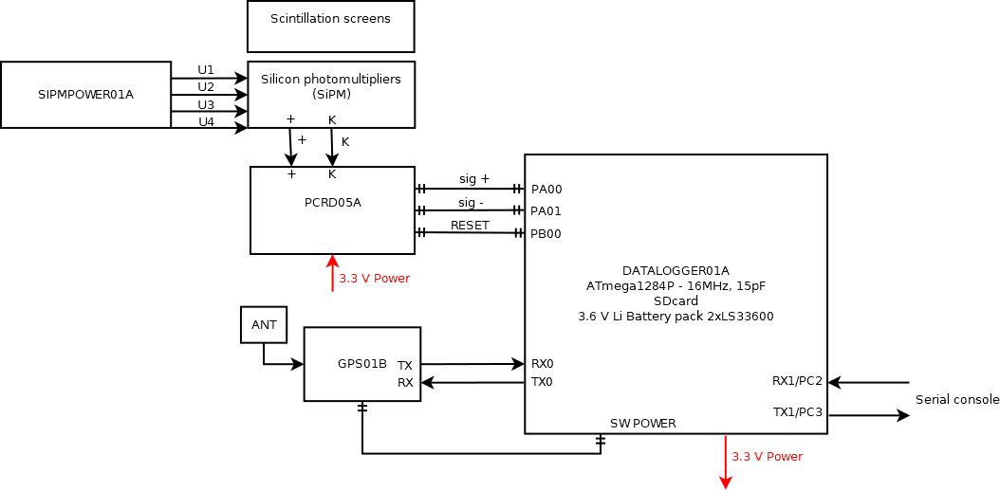
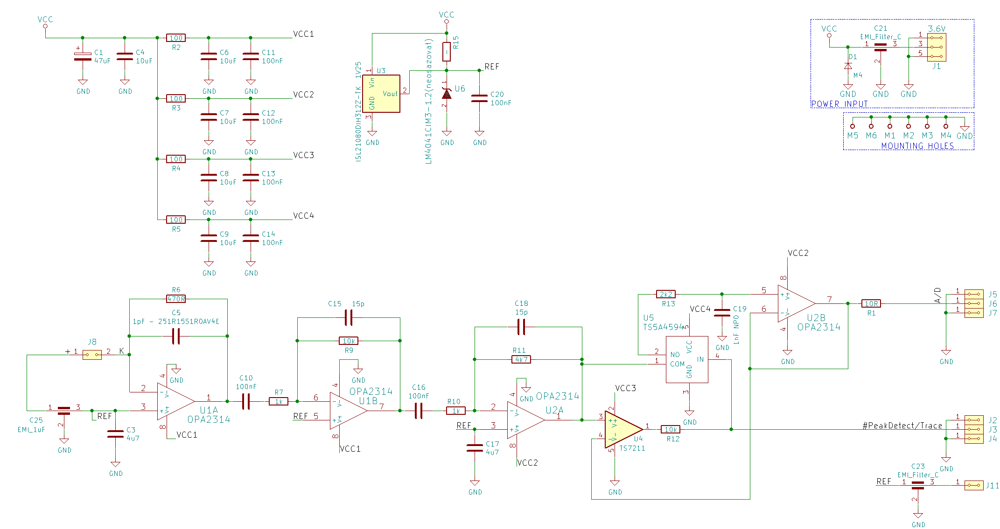
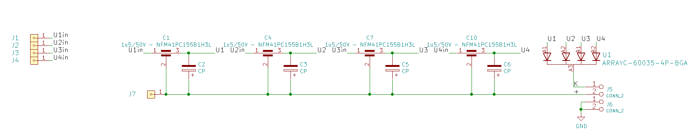
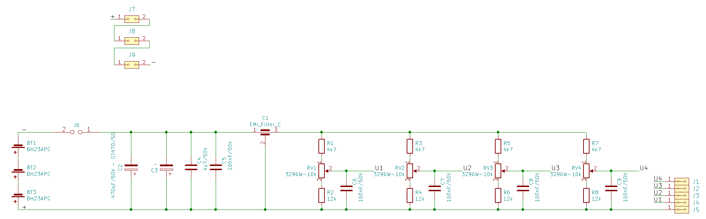

# AIRDOSC01
Scintillation detector of ionizing radiation.

Technical parameters are following: 

* Scintillation crystal with SiPM
* Measurement endurance 300 min

Device block diagram

PCRD05A semiconductor detector schematics

SIPM01B schematics

SIPMPOWER01A schematics
