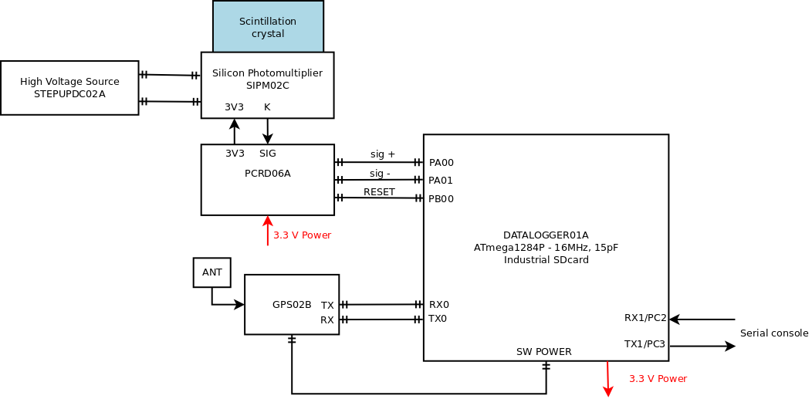

# AIRDOSC01B
*AIRDOS-C Scintillation detector of ionizing radiation with a full production specification available. The device can be further modified according to specific requirements. Character of its construction makes it especially suitable for placement into UAVs.*

**Technical parameters are following:**

* Detection element: scintillating crystal integrated with [SiPM](https://en.wikipedia.org/wiki/Silicon_photomultiplier)
* More than 90 days autonomous operation powered by lithium battery
* Data memory: SD card
* Data logs contains energy and time of each event
* Logging periodicity: 10 s (dead time 2 s)
* Time resolution: 20 us
* Accuracy of event’s time: 500 ns
* Dimensions: 57 x 107 x 167 mm
* Mass in operating condition (including batteries) 1 kg
* Open-source HW and SW
* Device status indicator: LED on panel
* Airborne GPS parameters (measurement altitude verified up to 36km amsl)

**Device block diagram**

**Production data of electronic modules**

* [STEPUPDC02A](https://github.com/mlab-modules/STEPUPDC02)
* [SIPM02C](https://github.com/mlab-modules/SIPM02) known as "AIRDOSC01A_PCB01C"
* [PCRD06A](https://github.com/mlab-modules/PCRD06)
* [GPS01B](https://www.mlab.cz/module/GPS01B)
* [DATALOGGER01A](http://mlab.cz/module/DATALOGGER01A)

Relevant scientific papers

* [CHARACTERISATION OF AIRDOS-C DETECTOR FOR MEASUREMENT OF HIGH-ENERGY EVENTS IN THE ATMOSPHERE](https://academic.oup.com/rpd/article-abstract/198/9-11/604/6672998?redirectedFrom=fulltext&login=false)
